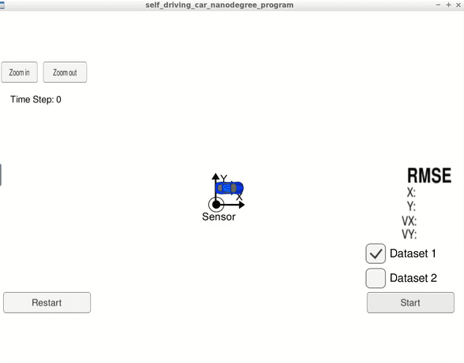
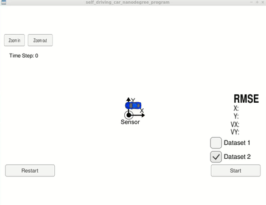

# CarND-Unscented-Kalman-Filter

Self-Driving Car Engineer Nanodegree Program

The goal of this project is to build an Unscented Kalman Filter using C++ and
use it to estimate the state of a moving object of interest with noisy LIDAR
and RADAR measurements.

The measurements data is provided in the form of a [simulator](https://github.com/udacity/self-driving-car-sim/releases).

The key metrics are [RMSE](https://en.wikipedia.org/wiki/Root-mean-square_deviation) values for both position and velocity of the tracked
object.

## Installation
This repository includes two files that can be used to set up and install [uWebSocketIO](https://github.com/uWebSockets/uWebSockets) for either Linux or Mac systems. For windows you can use either Docker, VMware, or even [Windows 10 Bash on Ubuntu](https://www.howtogeek.com/249966/how-to-install-and-use-the-linux-bash-shell-on-windows-10/) to install uWebSocketIO. Please see [this concept in the classroom](https://classroom.udacity.com/nanodegrees/nd013/parts/40f38239-66b6-46ec-ae68-03afd8a601c8/modules/0949fca6-b379-42af-a919-ee50aa304e6a/lessons/f758c44c-5e40-4e01-93b5-1a82aa4e044f/concepts/16cf4a78-4fc7-49e1-8621-3450ca938b77) for the required version and installation scripts.
## Results

The success metrics for this project are the RMSE values for 2 datasets.

The values shoule be below:
- `0.09` for `P x`,
- `0.10` for `P y`,
- `0.40` for `V x`,
- `0.30` for `V y`.

### RMSE values

The folowing table lists the results of both datasets:

| RMSE | Dataset 1 | Dataset 2 |
|------|-----------|-----------|
| P x  |  0.0979   |  0.1008   |
| P y  |  0.1208   |  0.1146   |
| V x  |  0.8136   |  0.9325   |
| V y  |  0.9955   |  1.0208   |


### Simulator Results

#### Dataset 1



#### Dataset 2



## Implementation

The code skeleton for this project was provided by udacity on [this repo](https://github.com/udacity/CarND-Unscented-Kalman-Filter-Project).

The main program in under the `src` directory.
```
.
├── json.hpp
├── main.cpp
├── measurement_package.h
├── tools.cpp
├── tools.h
├── ukf.cpp
└── ukf.h
```

The main changes were to the folowing files:
- `ukf.cpp` - initializes the Unscented Kalman filter, calls the predict and update function, defines the predict and update functions
- `tools.cpp` - function to calculate RMSE


## Dependencies

* cmake >= 3.5
  * All OSes: [click here for installation instructions](https://cmake.org/install/)
* make >= 4.1 (Linux, Mac), 3.81 (Windows)
  * Linux: make is installed by default on most Linux distros
  * Mac: [install Xcode command line tools to get make](https://developer.apple.com/xcode/features/)
  * Windows: [Click here for installation instructions](http://gnuwin32.sourceforge.net/packages/make.htm)
* gcc/g++ >= 5.4
  * Linux: gcc / g++ is installed by default on most Linux distros
  * Mac: same deal as make - [install Xcode command line tools](https://developer.apple.com/xcode/features/)
  * Windows: recommend using [MinGW](http://www.mingw.org/)

## Build

1. Clone this repo.
2. Make a build directory: `mkdir build && cd build`
3. Compile: `cmake .. && make` 
   * On windows, you may need to run: `cmake .. -G "Unix Makefiles" && make`
4. Run it: `./ExtendedKF `


